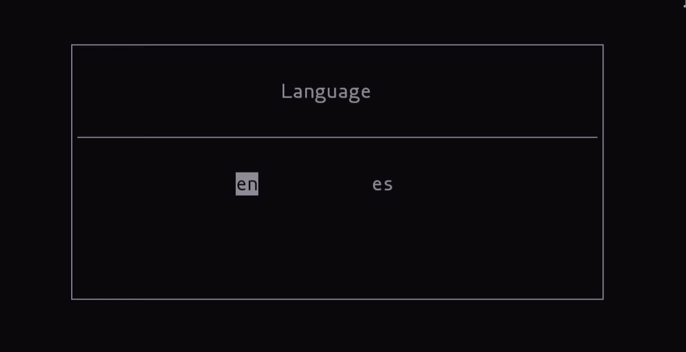

<div align="center"

# Typit


C++ terminal application designed to improve typing speed.



</div>

---

## Features

- Support for Windows and Linux.
- Terminal typing with real-time WPM (words per minute) tracking.
- English and Spanish language support.
- Infinite random word generation.
- Error and accuracy measurement.
- Time attack mode with infinite words and mode with a maximum number of words.

---

## Installation

``` bash
# Same for Windows and Linux
# Clone the repository
git clone https://github.com/vid4l-07/typit.git
cd typit

# Compile
mkdir build
cd build
cmake ..
cmake --build .

# Run
./typit
```

---

## Usage

In the menu: 
- Navigate with the left and right arrow keys. 
- Modify numbers such as time or words with the up and down arrows.
- Press Enter to continue.

During the game: 
- You can delete up to 5 characters to correct mistakes, but these will not be subtracted.

## Contributions

Contributions are always welcome! If you find a bug or want to contribute an improvement you can: 
- Open an issue in this repository. 
- Fork the repository. 
- Open a Pull Request. 
- Or send me an email at <a href="mailto:h.vidal7@proton.me"> h.vidal7@proton.me </a>
